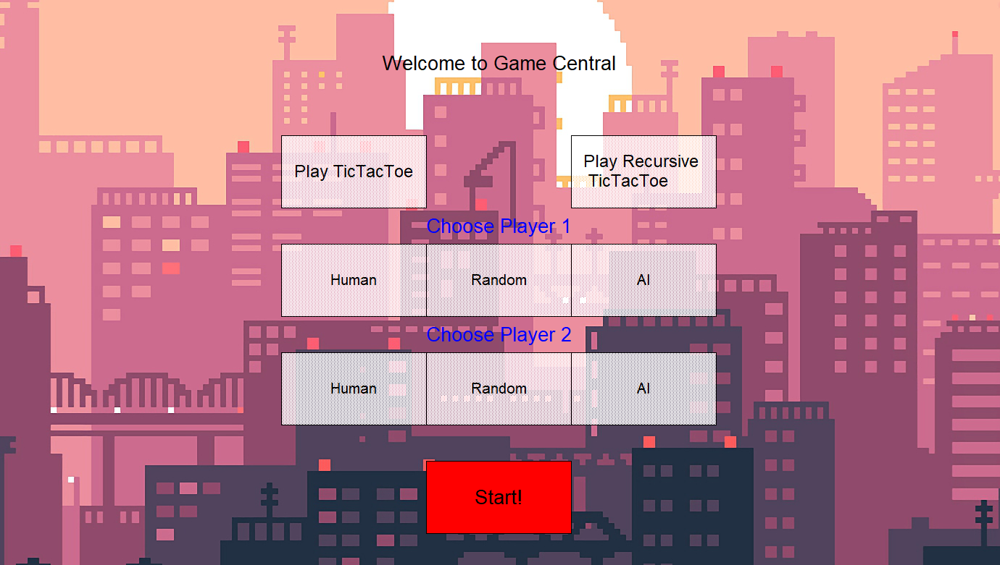
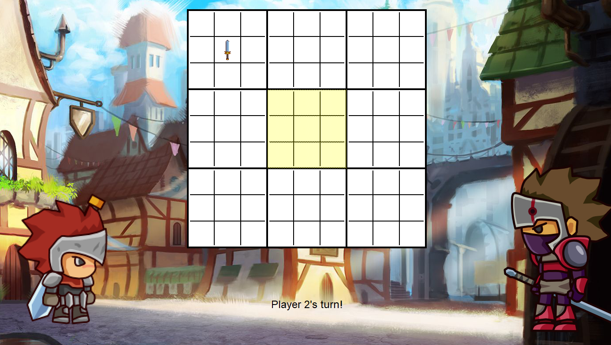

# About
------------------
This procject is about implementing a game of Tic-Tac-Toe and a game of Ultimate Tic-Tac-Toe. 

This project was implemented by Zohaib and Sean.
This is version 1.0 of the project.

# Getting Started
------------------
This project requires the installation of pygame to run. To install pygame, use the command below in the terminal.
> python -m pip install pygame

Once pygame is installled, run the main file to start the game.

# How To Play Ultimate Tic-tac-Toe
------------------
In ultimate tic-tac-toe, there are nine smaller games of tic-tac-toe inside of a a 3x3 grid, called 'global board'. A player must win 3 of these smaller boards, called 'local boards', in a a row to win the game.

At the start of the game, the first player has free rein to choose any square on any of the local boards. Howwever, the next player is restricted teo a single local board. This board is determined by the first players position on the local borad corresponding to the global board. This local board is highlighted in yellow. The image below shows player one placing an 'X', a sword in this case, in the top right grid on the global board, but in the middle square in the local board. Player 'O', shield in this case, is now restricted to the middle grid on the global board.

